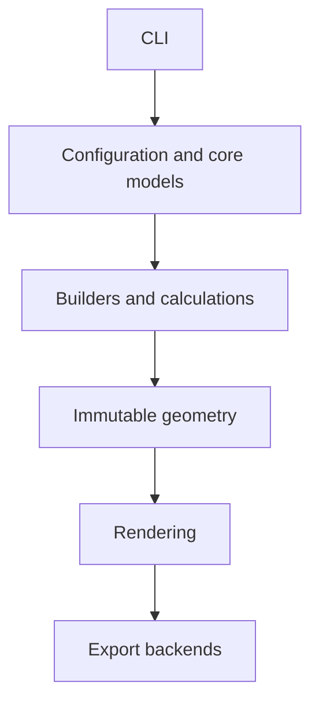
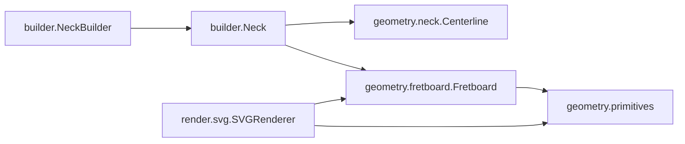

# Architecture

CNCguitarwizard keeps geometry independent from rendering and export backends.
Dependencies point down through the layers; lower layers never import higher
ones.

## Current Packages

## Package Responsibilities

| Layer | Packages | Responsibility |
| --- | --- | --- |
| Core | `core`, `validation` | Project state and parameter validation. |
| Calculation | `builder`, `geometry.fret` | Build models and calculate fret locations. |
| Geometry | `geometry`, `geometry.neck`, `geometry.fretboard` | Immutable mathematical facts and outlines. |
| Rendering | `render.svg` | Convert geometry to standalone SVG documents. |

## Design Rules

- Geometry values are immutable dataclasses with slots.
- All dimensions use millimetres.
- Renderers consume geometry but geometry never depends on renderers.
- Public APIs remain small; new behavior is added only when required.
- Every behavior change includes tests, documentation, and a HISTORY entry.

Development priorities remain correctness, manufacturability, stability,
performance, usability, polish, and then Easter eggs.
