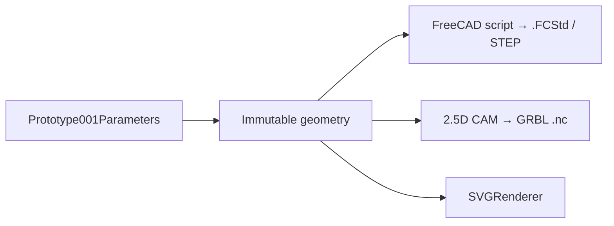

# CNCguitarwizard

CNCguitarwizard is an open-source Python foundation for designing guitar
necks, fretboards, bodies, and CNC-ready geometry. The current release
provides immutable geometry, fret and fretboard calculations, a fluent neck
builder, dependency-free SVG rendering, a FreeCAD backend that builds the
complete Prototype001 neck, fretboard, headstock and body as `.FCStd` and
STEP files, and a dependency-free 2.5D CAM planner that writes GRBL G-code
for the body.

## Getting started

You need Python 3.12 or newer. FreeCAD (1.0+) is optional: without it you
still get the FreeCAD scripts and all of the G-code, just not the `.FCStd`
and STEP models.

```bash
git clone <this repository>
cd CNCguitarwizard
python3 -m venv .venv
source .venv/bin/activate        # Windows: .venv\Scripts\activate
python -m pip install -e .
```

Build Prototype001 — the complete left-handed guitar: neck, fretboard,
headstock and body — with one command:

```bash
python -m cncguitarwizard build-prototype001 --output build
```

The build locates `freecadcmd` on its own (including the standard macOS
`/Applications/FreeCAD.app` location); point it elsewhere with
`--freecad-command /path/to/freecadcmd` or the `FREECAD_CMD` environment
variable, or skip FreeCAD entirely with `--scripts-only`.

Everything lands in the `build/` directory (git-ignored):

| File | What it is |
| --- | --- |
| `Prototype001.FCStd` | Editable FreeCAD document: neck, fretboard and body as separate solids |
| `Prototype001.step` | The same three solids for any other CAD/CAM tool |
| `Prototype001.FCMacro`, `Prototype001_freecad.py` | The generated FreeCAD script (macro and plain-Python form) |
| `Body_index_pins.nc`, `Body_top.nc`, `Body_back.nc` | GRBL G-code for the body, in running order — see [Body G-code](docs/cam/01_body_gcode.md) |
| `Body_*.svg` | Toolpath plots of those programs |
| `build.json` | Every parameter used, stock size, per-program time estimates, checksums |
| `freecad.log` | FreeCAD's own output from the run |

To change a dimension, edit the defaults in
`src/cncguitarwizard/presets/prototype001.py` (every value is a documented
field of `Prototype001Parameters`) or build from Python with overrides:

```python
from dataclasses import replace
from pathlib import Path

from cncguitarwizard.presets import Prototype001Parameters
from cncguitarwizard.workflows import build_prototype001

parameters = replace(Prototype001Parameters(), body_thickness=42.0)
build_prototype001(Path("build"), parameters)
```

Tool, feed and fixturing settings for the G-code live in
`cncguitarwizard.cam.MachiningParameters` and can be passed the same way
(`build_prototype001(..., machining=MachiningParameters(feed_rate=800.0))`).

## In the browser

The same package runs client-side on GitHub Pages: `site/` loads it into
Pyodide, draws a form from the parameter dataclasses, and builds the
FreeCAD script, body G-code, toolpath plots and report in the browser —
no installation needed. Only the `.FCStd`/STEP step still needs a local
FreeCAD. See [Web app](docs/site.md) for local preview and deployment.

## Architecture



## Python API quick start

```python
from cncguitarwizard.builder import NeckBuilder
from cncguitarwizard.render.svg import SVGRenderer

neck = (
    NeckBuilder()
    .scale_length(609.6)
    .nut_width(42.0)
    .bridge_width(63.0)
    .build()
)

svg = SVGRenderer().render(neck.fretboard)
```

## Documentation

- [Public package reference](docs/reference/01_public_packages.md)
- [Geometry](docs/geometry/01_primitives.md)
- [Fretboard](docs/geometry/02_fretboard.md)
- [Solid body](docs/geometry/12_body.md)
- [Neck builder](docs/builder/01_neck_builder.md)
- [Prototype001 preset](docs/presets/prototype001.md)
- [Building Prototype001 in FreeCAD](docs/workflows/prototype001.md)
- [FreeCAD backend](docs/backends/freecad.md)
- [Body G-code](docs/cam/01_body_gcode.md)
- [Web app on GitHub Pages](docs/site.md)
- [SVG rendering](docs/render/01_svg.md)
- [Architecture](ARCHITECTURE)
- [Roadmap](ROADMAP)

## Development

Install the development extras on top of the setup above, then run the
full quality gate before completing a change:

```bash
python -m pip install -e ".[dev]"
```

```bash
python -m pytest
ruff check .
mypy
```

GitHub Actions runs the same pytest, Ruff, and mypy checks on every push and
pull request. Python warnings fail the test step.
