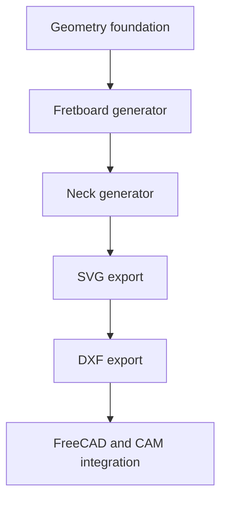

# Roadmap

## Completed Foundation

- Immutable two-dimensional geometry primitives and transforms
- Neck centerline, equal-temperament frets, and tapered fretboard outlines
- Fluent immutable neck builder
- Dependency-free SVG output with snapshot tests

## Next: Fretboard Generator

- Compose fret lines with the fretboard outline
- Define fretboard boundary intersections
- Add manufacturing-oriented validation

## Planned: Neck Generator

- Add neck profile and thickness geometry
- Generate headstock and heel reference geometry
- Keep all dimensions in millimetres

## Planned: Export Backends

- Extend SVG output with styles and document bounds
- Add DXF export without coupling geometry to any renderer
- Evaluate FreeCAD and CAM integrations behind backend interfaces

