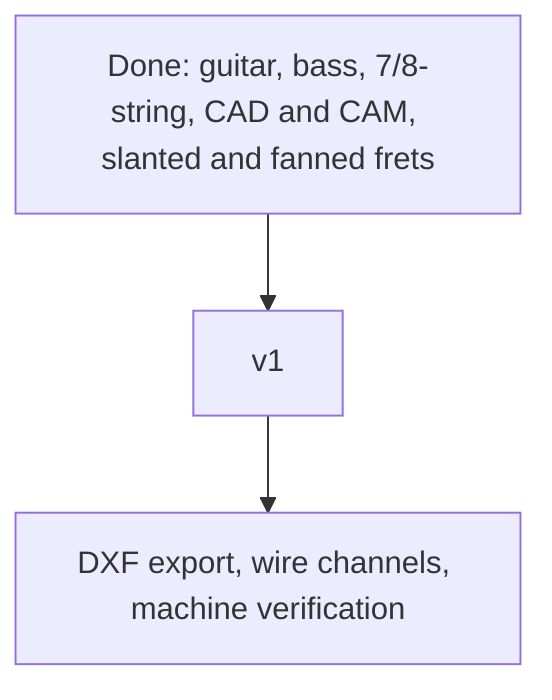

# Roadmap

## Done

- Geometry foundation: immutable 2D primitives, equal-temperament frets,
  tapered fretboard outlines, the fluent neck builder, SVG output
- Neck: D-profile back surface, heel and bolt-on block, truss-rod channel,
  headstock styles (3+3, in line, 4+2, 4+3, 4+4, bass 4 in line) with fitted
  or drawn edges, tuner layout, inlays
- Fretboard: radius, fret slots, inlay pockets
- Body: Design by Jone and drawn bodies with templates, pickup layouts,
  bridges, control layouts with sheet-cut covers, neck bolts, optional
  roundovers, binding channel, arm contour and belly cut
- Instruments: six-, seven- and eight-string guitars and a four-string bass
- FreeCAD script export (FCStd and STEP) and GRBL G-code for body, neck,
  fretboard and covers, with toolpath previews
- Web app running the package in the browser (Pyodide), with body and
  headstock editors and NC Viewer simulation

## Before v1

- **Slanted frets** — done: `fret_slant_angle` tilts every fret and both
  fretboard ends about the centerline; the bridge and pickups stay put.
- **Multiscale (fanned frets)** — done: `bass_scale_length` and
  `perpendicular_fret`; frets, nut and pickups fan between the two
  scales, the bridge stays square with its saddles set per string (a
  Tune-o-matic, and a hardtail on request, follow the fan).
- **Save and load designs** — done: the web app saves every setting, the
  drawn body and headstock included, as a JSON file on your own computer
  and loads it back.
- **9 V battery box** — done: `body_battery_box` routes an optional
  battery box in the back with its own sheet-cut cover, placed per body
  shape and dragged in the body editor.
- **Stock truss-rod lengths** — done: the neck is routed for the longest
  20 mm stock rod that fits, or checks the rod in hand.
- Release v1.

## Later

- DXF export of the plan outlines
- Wire channels between cavities
- Machine-verified toolpaths (air cuts and first real blanks)

```mermaid
flowchart TD
    Done["Done: guitar, bass, 7/8-string, CAD and CAM, slanted and fanned frets"] --> V1["v1"]
    V1 --> Later["DXF export, wire channels, machine verification"]
```
