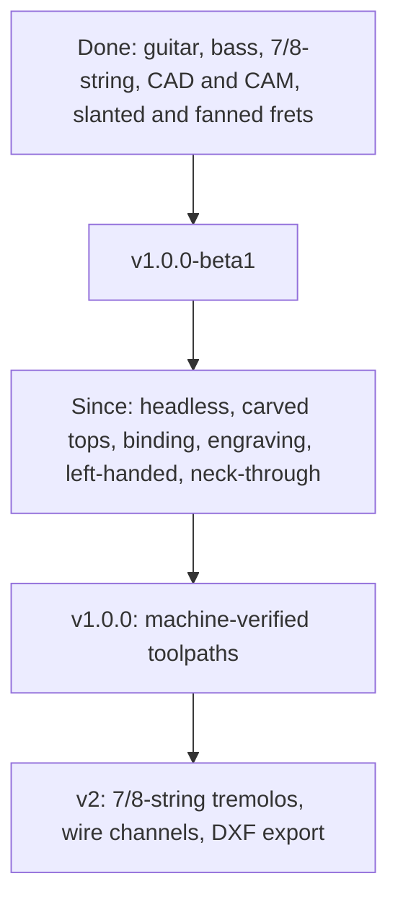

# Roadmap

## Done

- Geometry foundation: immutable 2D primitives, equal-temperament frets,
  tapered fretboard outlines, the fluent neck builder, SVG output
- Neck: D-profile back surface, heel and bolt-on block, truss-rod channel,
  headstock styles (3+3, in line, 4+2, 4+3, 4+4, bass 4 in line) with fitted
  or drawn edges, tuner layout, inlays
- Fretboard: radius, fret slots, inlay pockets
- Body: Design by Jone and drawn bodies with templates, pickup layouts,
  bridges, control layouts with sheet-cut covers, neck bolts, optional
  roundovers, binding channel, arm contour and belly cut
- Instruments: six-, seven- and eight-string guitars and a four-string bass
- FreeCAD script export (FCStd and STEP) and GRBL G-code for body, neck,
  fretboard and covers, with toolpath previews
- Web app running the package in the browser (Pyodide), with body and
  headstock editors and NC Viewer simulation
- Headless guitars and basses: no headstock, the strings anchored at the
  nut end and tuned at the bridge
- Carved (arched) tops, Les Paul style, on any body, roughed to sand by
  hand (a bigger roughing tool or a ball-nose finish on request)
- Fretboard binding; more fretboard markers, cut from sheet where they
  are not dots
- Decorative engravings on the top (scrolls, EVH stripes, flame, ripples,
  crackle) and lettering engraved in the headstock face
- Left-handed instruments: any design built as its mirror image
- Neck-through construction: the neck blank as the body's centre block,
  two wings cut on their own and glued to its sides; or the neck and the
  whole body from one blank; and set (glued) necks
- Carbon fibre neck reinforcement beside the truss rod; a zero fret
- Neck angle (a tilted pocket floor for a Tune-o-matic), a Telecaster
  neck (slotted nut, Tele headstock), low-profile truss rods and a spoke
  wheel choice

## Before v1

- **Slanted frets** — done: `fret_slant_angle` tilts every fret and both
  fretboard ends about the centerline; the bridge and pickups stay put.
- **Multiscale (fanned frets)** — done: `bass_scale_length` and
  `perpendicular_fret`; frets, nut and pickups fan between the two
  scales, the bridge stays square with its saddles set per string (a
  Tune-o-matic, and a hardtail on request, follow the fan).
- **Save and load designs** — done: the web app saves every setting, the
  drawn body and headstock included, as a JSON file on your own computer
  and loads it back.
- **9 V battery box** — done: `body_battery_box` routes an optional
  battery box in the back with its own sheet-cut cover, placed per body
  shape and dragged in the body editor.
- **Stock truss-rod lengths** — done: the neck is routed for the longest
  20 mm stock rod that fits, or checks the rod in hand.
- **G-code dialects** — done: every program in GRBL (default), LinuxCNC,
  Mach3/4 / UCCNC, Marlin, Fanuc-style or KOSY / nccad (`.knc`) G-code,
  with an optional spindle spin-up dwell.
- **v1.0.0-beta1** — released 2026-09-27 with everything above; v1.0.0
  follows once the toolpaths are machine-verified (air cuts and first real
  blanks).

## v1.0.0

- Machine-verified toolpaths: air cuts and the first real blanks for the
  body, neck, fretboard and covers.

## v2

Instruments and construction
- More bridges: Floyd Rose and Kahler for seven and eight strings, and
  more bass bridges.

Electronics
- More control cavity layouts.
- Wire channels between the cavities — pickups, controls, the battery box
  and the jack — cut or at least modelled, instead of drilled by hand.
- The battery box and the controls placed together, so neither blocks the
  other (Jackson RR with a Gibson cavity, a Floyd Rose and a battery box
  is still refused).

Neck and fretboard
- The parts now given as notes (a truss rod's sleeve bore) modelled or
  cut where the machine can.

Tools and templates
- Rotating the pickups in the body editor (the control cavity, the
  battery box and the jack already turn).
- More mockup body templates, and headstock templates, made the same way
  (traced, reshaped by hand, marked as mockups).
- DXF export of the plan outlines.

```mermaid
flowchart TD
    Done["Done: guitar, bass, 7/8-string, CAD and CAM, slanted and fanned frets"] --> Beta["v1.0.0-beta1"]
    Beta --> More["Since: headless, carved tops, binding, engraving, left-handed, neck-through"]
    More --> V1["v1.0.0: machine-verified toolpaths"]
    V1 --> V2["v2: 7/8-string tremolos, wire channels, DXF export"]
```
