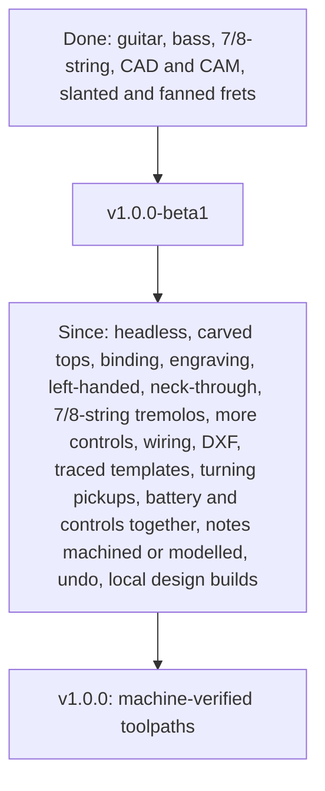

# Roadmap

## Done

- Geometry foundation: immutable 2D primitives, equal-temperament frets,
  tapered fretboard outlines, the fluent neck builder, SVG output
- Neck: D-profile back surface, heel and bolt-on block, truss-rod channel,
  headstock styles (3+3, in line, 4+2, 4+3, 4+4, bass 4 in line) with fitted
  or drawn edges, tuner layout, inlays
- Fretboard: radius, fret slots, inlay pockets
- Body: Design by Jone and drawn bodies with templates, pickup layouts,
  bridges, control layouts with sheet-cut covers, neck bolts, optional
  roundovers, binding channel, arm contour and belly cut
- Instruments: six-, seven- and eight-string guitars and a four-string bass
- FreeCAD script export (FCStd and STEP) and GRBL G-code for body, neck,
  fretboard and covers, with toolpath previews
- Web app running the package in the browser (Pyodide), with body,
  headstock and inlay editors and NC Viewer simulation
- Headless guitars and basses: no headstock, the strings anchored at the
  nut end and tuned at the bridge
- Carved (arched) tops, Les Paul style, on any body, roughed to sand by
  hand (a bigger roughing tool or a ball-nose finish on request)
- Fretboard binding; more fretboard markers, cut from sheet where they
  are not dots
- Decorative engravings on the top (scrolls, EVH stripes, flame, ripples,
  crackle) and lettering engraved in the headstock face
- Left-handed instruments: any design built as its mirror image
- Neck-through construction: the neck blank as the body's centre block,
  two wings cut on their own and glued to its sides; or the neck and the
  whole body from one blank; and set (glued) necks
- More bridges: the Floyd Rose and the Kahler for seven and eight strings
  (with Floyd Rose's seven- and eight-string locking nuts), single-string
  bridges that follow a fan, and a top-loaded hardtail for the bass
- More control layouts: a superstrat rear cavity with the 5-way blade
  switch, a single volume pot, an active bass's four pots, and a Jazz Bass
  plate carrying the jack
- String ferrules counterbored from the back, the bridges' fitting notes
  in the programs
- DXF export of the plan outlines and the sheet plates
- Pickups turned in the body editor (Shift-drag), as the controls, the
  battery box and the jack
- The battery box and the controls placed together, so neither blocks
  the other
- Parts once left to notes machined where a router can (the truss rod's
  sleeve slot, a locking nut's screw pilots) and modelled where it cannot
  (a Floyd Rose's trem-claw screw holes)
- Older saved designs brought up to date on loading, every setting in
  view and every editor drawn
- Undo and redo for the editors and the form
- Humbucker frames to draw in the body editor and cut from sheet
- Body and headstock outlines drawn in another program: SVG templates out
  and back in
- Surface patterns drawn in another program, through the body's SVG template
- A jig for filing the nut's string slots, cut from sheet
- Toolpath plots wide enough for their titles over a small part
- The build's result and summary first in view, as soon as the build is done
- The editors' how-tos folded away until asked for
- Every setting that changes a drawing above it in the editor, folded under Settings, the body's in two columns
- The inlay marker drawn in another program: SVG templates out and back in
- Start from in the inlay editor
- Engraving drawn on the headstock face in another program, pictures traced
- A Reroll button beside the pattern's random seed
- The editors' outlines to a CAD program and back: DXF templates
- The body editor turned upright, the neck up, as a view
- The Build button on a row of its own
- Editor button rows on one line: a File menu, Auto buttons where they apply, the form column in view
- Find a setting: the form filtered by name and meaning
- The form's fields labelled in words
- A shorter build result: downloads folded by part, programs summed up
- Show only the settings changed from their defaults
- Editor status lines: an import's note apart, problems in bold red
- The design kept in the browser and put back on loading
- Ctrl/Cmd+Enter builds
- A field's meaning under it while it is selected
- The toolpath plots chosen from a list by part
- Zoom in the editors
- A loaded design's body and bridge not shown changed when they are the instrument's own
- A result that says when the design has changed since its build
- The form's groups counting their changed settings
- Quick links to the result, the editors and the settings
- Zoom in the plan view and the toolpath plots
- Escape closing the File menu
- A changed setting's default and Reset to default under it
- The guitar's name and the build's state in the tab's title
- A list of the shortcuts
- Enter and Escape in Find a setting
- The form's open groups kept across reloads
- The wheel scrolling past a selected number field, not changing it
- Shift and Alt/Option arrows stepping a number field by 10 and 0.1
- A value that cannot be read marked at once, the reason under it
- Undo and Redo tooltips naming the fields by their labels
- / going to Find a setting
- The number of changed settings in all, by Show only the settings changed
- Resetting one group of the form to its defaults
- Go to the field a build stops at
- Ctrl/Cmd+S and Ctrl/Cmd+O saving and loading the design
- A design dropped on the page loaded
- An outline dropped on an editor's drawing imported
- A body too thin named by its thickness, not by a neck bolt, pocket or
  cavity cut from it
- A zoomed drawing's chip that fits it again
- Save design marked while the design is unsaved
- A printed sheet of the result for the workshop
- A guided tour of the basic path, ending at Build
- Tuner holes dragged in the headstock editor, and following a dragged edge
- A measurement by the pointer while dragging in the editors
- Two-finger pinch zoom on touch screens
- The searched words marked in the fields' names
- A ruler to drag over the drawings
- A drawing over the whole window
- The recent designs, a click away
- Handles moved with the arrow keys
- A drawing's chips above it, not over its top
- A depth bar on every toolpath plot
- An editor's status and Undo in its full window
- The plan view's parts named under the pointer
- A toolpath plot's toolpaths named under the pointer
- A program's plot from its row in Every program
- The form's group titles kept in sight
- Body features moved with the arrow keys
- The shown program's details and Simulate in the toolpath view
- Build floating in the corner while the page's own is out of sight
- A heel relief on the back where the neck joins: a contour or a notch, drawn in the body editor
- Index pins as wide as a main tool wider than 6 mm (an 8 mm end mill,
  8 mm dowels)
- The neck's back carved with the ball nose alone, in one program
- Truss-rod covers to choose (bell, Ibanez / ESP, PRS, rectangle) and to
  draw and size in the headstock editor
- A traced barbed-wire knot inlay (`barbed_wire_2`), one piece
- The fretboard blank as bought: its size and thickness, and a carrier
  board taking the dowels past a short blank's ends
- A saved design built locally from the command line (`--design`),
  FreeCAD models included
- Headstock errors that name the setting to mend; a hooked drawn tip
  modelled as drawn; a saved drawing its tuners no longer fit opens to
  be mended; neck and body templates that leave nothing of the one
  before
- More templates traced from product photos: Mockingbird (reshaped by
  hand), Telecaster, SG, Explorer and Flying V bodies;
  Stratocaster, Gibson style, Flying V, Explorer and Mockingbird
  headstocks, a row of tuners placed along a steep edge
- Wire channels: the pickups, a switch cavity and a battery box wired to
  the controls and the bridge grounded, routed under a pickguard,
  elsewhere drilled by hand (modelled, with each hole's angle in the
  notes)
- Carbon fibre neck reinforcement beside the truss rod; a zero fret
- Neck angle (a tilted pocket floor for a Tune-o-matic), a Telecaster
  neck (slotted nut, Tele headstock), low-profile truss rods and a spoke
  wheel choice

## Before v1

- **Slanted frets** — done: `fret_slant_angle` tilts every fret and both
  fretboard ends about the centerline; the bridge and pickups stay put.
- **Multiscale (fanned frets)** — done: `bass_scale_length` and
  `perpendicular_fret`; frets, nut and pickups fan between the two
  scales, the bridge stays square with its saddles set per string (a
  Tune-o-matic, and a hardtail on request, follow the fan).
- **Save and load designs** — done: the web app saves every setting, the
  drawn body and headstock included, as a JSON file on your own computer
  and loads it back.
- **9 V battery box** — done: `body_battery_box` routes an optional
  battery box in the back with its own sheet-cut cover, placed per body
  shape and dragged in the body editor.
- **Stock truss-rod lengths** — done: the neck is routed for the longest
  20 mm stock rod that fits, or checks the rod in hand.
- **G-code dialects** — done: every program in GRBL (default), LinuxCNC,
  Mach3/4 / UCCNC, Marlin, Fanuc-style or KOSY / nccad (`.knc`) G-code,
  with an optional spindle spin-up dwell.
- **v1.0.0-beta1** — released 2026-09-27 with everything above; v1.0.0
  follows once the toolpaths are machine-verified (air cuts and first real
  blanks).

## v1.0.0

- Machine-verified toolpaths: air cuts and the first real blanks for the
  body, neck, fretboard and covers.

```mermaid
flowchart TD
    Done["Done: guitar, bass, 7/8-string, CAD and CAM, slanted and fanned frets"] --> Beta["v1.0.0-beta1"]
    Beta --> More["Since: headless, carved tops, binding, engraving, left-handed, neck-through, 7/8-string tremolos, more controls, wiring, DXF, traced templates, turning pickups, battery and controls together, notes machined or modelled, undo, local design builds"]
    More --> V1["v1.0.0: machine-verified toolpaths"]
```
