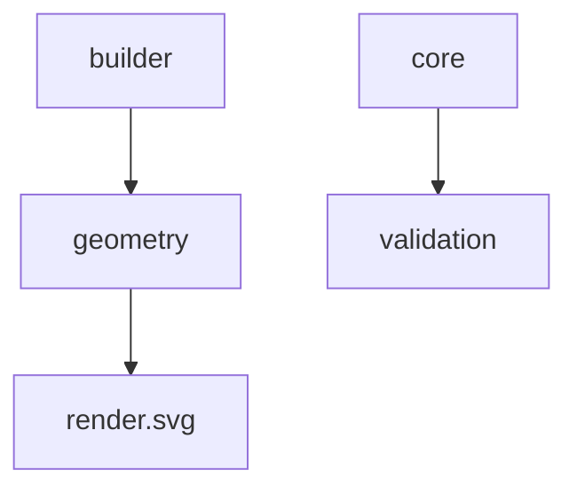
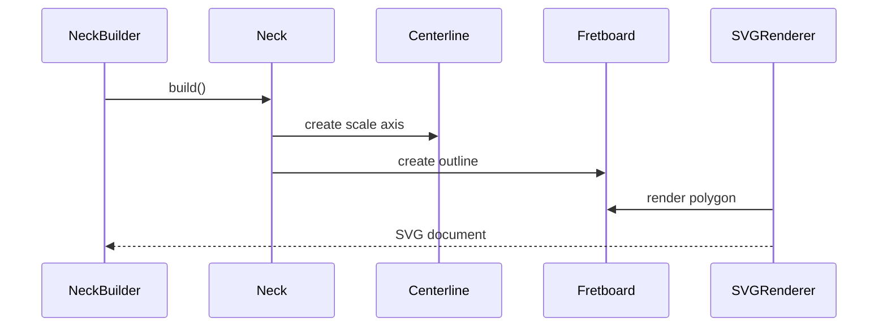

# Public Package Reference

This reference lists the stable public packages currently provided by
CNCguitarwizard. All dimensions are expressed in millimetres unless stated
otherwise.



## `cncguitarwizard`

The root package provides the application entry point, invoked with
`python -m cncguitarwizard`.

```bash
python -m cncguitarwizard
```

## `cncguitarwizard.builder`

| API | Purpose |
| --- | --- |
| `NeckBuilder` | Fluent construction of a neck model. |
| `Neck` | Immutable model containing dimensions, centerline, and fretboard. |
| `BuilderError` | Raised when required builder dimensions are missing or invalid. |

```python
from cncguitarwizard.builder import NeckBuilder

neck = (
    NeckBuilder()
    .scale_length(609.6)
    .nut_width(42.0)
    .bridge_width(63.0)
    .build()
)
```

## `cncguitarwizard.core`

| API | Purpose |
| --- | --- |
| `Project` | Root project object. |
| `ProjectMetadata` | Project identity, timestamps, and version. |
| `NeckParameters` | Editable neck parameter collection. |

```python
from cncguitarwizard.core.project import Project

project = Project()
project.touch()
```

## `cncguitarwizard.geometry`

| API | Purpose |
| --- | --- |
| `Point2D` | Immutable two-dimensional coordinate. |
| `Vector2D` | Immutable displacement with vector operations. |
| `Line2D` | Immutable line segment. |
| `GeometryException` | Base geometry exception. |
| `ZeroLengthVectorError` | Raised for undefined zero-vector operations. |

```python
from cncguitarwizard.geometry import Line2D, Point2D, Vector2D

line = Line2D(Point2D(0.0, 0.0), Point2D(3.0, 4.0))
direction = Vector2D(3.0, 4.0).normalized()
assert line.length == 5.0
assert direction.length == 1.0
```

### `cncguitarwizard.geometry.primitives`

This package exports `Point2D`, `Vector2D`, and `Line2D`. `Vector2D` provides
`length`, `normalized()`, `dot()`, `cross()`, `angle_to()`, and
`perpendicular()`. `Line2D` provides `length`.

It also exports two polygon helpers used by the body model:
`rounded_polygon_points(vertices, radii, samples_per_corner)` replaces each
corner of a polygon with a sampled fillet arc, and `point_in_polygon(point,
polygon)` is a ray-casting containment test.

### `cncguitarwizard.geometry.utils`

| API | Purpose |
| --- | --- |
| `distance(start, end)` | Measure the distance between two points. |
| `midpoint(start, end)` | Create the halfway point. |
| `interpolate(start, end, fraction)` | Create an interpolated or extrapolated point. |

```python
from cncguitarwizard.geometry import Point2D
from cncguitarwizard.geometry.utils import midpoint

assert midpoint(Point2D(0.0, 0.0), Point2D(4.0, 2.0)) == Point2D(2.0, 1.0)
```

### `cncguitarwizard.geometry.transforms`

| API | Purpose |
| --- | --- |
| `translate(point, vector)` | Return a displaced point. |
| `rotate(point, angle)` | Return a point rotated about the origin in radians. |
| `mirror_x(point)` | Return a point reflected across the x-axis. |
| `mirror_y(point)` | Return a point reflected across the y-axis. |

```python
from cncguitarwizard.geometry import Point2D, Vector2D
from cncguitarwizard.geometry.transforms import translate

assert translate(Point2D(1.0, 2.0), Vector2D(3.0, -1.0)) == Point2D(4.0, 1.0)
```

### `cncguitarwizard.geometry.neck`

| API | Purpose |
| --- | --- |
| `Centerline` | Immutable nut-to-bridge reference axis. |

```python
from cncguitarwizard.geometry.neck import Centerline

centerline = Centerline(609.6)
assert centerline.length == 609.6
```

### `cncguitarwizard.geometry.fret`

| API | Purpose |
| --- | --- |
| `FretCalculator` | Equal-temperament fret position calculator. |
| `FretPosition` | Immutable calculated fret distance. |
| `FretLine` | Infinite fret line represented by location and direction. |

```python
from cncguitarwizard.geometry.fret import FretCalculator, FretLine
from cncguitarwizard.geometry.neck import Centerline

centerline = Centerline(609.6)
position = FretCalculator.calculate(centerline.length, 1)[0]
first_fret = FretLine(centerline, position)
```

### `cncguitarwizard.geometry.fretboard`

| API | Purpose |
| --- | --- |
| `Fretboard` | Immutable tapered fretboard outline. |
| `FretboardSurface` | Sampled three-dimensional radiused playing surface. |
| `FretLayout` | Fret-slot positions aligned to a fretboard surface. |
| `InlayLayout` | Position-marker pockets on a fretboard surface. |
| `InlayMarker` | One marker: fret number, outline, and lateral placement. |

`Fretboard` exposes `left_edge`, `right_edge`, `nut_line`, `bridge_line`, the
four-segment `outline` tuple, and an 8 mm default `nut_corner_radius`.
`InlayLayout(fretboard_surface, depth, single_marker_frets,
double_marker_frets)` builds barbed-wire markers centred between the listed
frets, with a side-by-side pair at each double-marker fret.

```python
from cncguitarwizard.geometry.fretboard import Fretboard
from cncguitarwizard.geometry.neck import Centerline

fretboard = Fretboard(609.6, 42.0, 63.0, Centerline(609.6))
assert fretboard.nut_line.length == 42.0
```

### `cncguitarwizard.geometry.body`

| API | Purpose |
| --- | --- |
| `BodySolid` | Complete flat-slab body with every cavity, hole, and bore, cross-validated. |
| `BodyOutline` | Parametric superstrat-style silhouette. |
| `TracedOutline` | Silhouette from an explicit closed point loop. |
| `RectangularCavity` | Rounded-corner rectangular pocket. |
| `CircularCavity` | Round pocket. |
| `TracedCavity` | Pocket from an explicit point loop. |
| `RearCavity` | Cavity plus cover recess, cut from the back face. |
| `DrilledHole` | Vertical hole from the top face. |
| `BridgeMounting` | Bridge reference with optional pivot studs and sustain-block cavity. |
| `JackHole` | Sideways jack bore from the edge. |

All raise `BodyGeometryError` for impossible dimensions or placements. See
[Solid body](../geometry/12_body.md) for the coordinate frame, the validation
rules, and how Prototype001's body was digitised from a DXF drawing.

## `cncguitarwizard.cam`

| API | Purpose |
| --- | --- |
| `MachiningParameters` | Tool, feeds, step-down, allowance, tabs, and index pins. |
| `plan_body_machining(body, parameters)` | Two-sided `BodyMachiningPlan` for a `BodySolid`. |
| `pocket()`, `drill()`, `profile()` | 2.5D operations on closed polygons in a machine frame. |
| `Toolpath`, `Move`, `PathBuilder` | Tool-centre move sequences. |
| `Setup`, `GRBLWriter` | One fixturing's toolpaths and its GRBL G-code. |
| `render_setup_svg()` | Toolpath plot over the part outline. |
| `clear_intervals()`, `offset_polygon()`, `disc_fits()` | Exact planar clearance helpers. |

See [Body G-code](../cam/01_body_gcode.md).

## `cncguitarwizard.render`

The rendering namespace contains output backends. It currently has no direct
symbols; use a concrete backend such as `render.svg`.

### `cncguitarwizard.render.svg`

| API | Purpose |
| --- | --- |
| `SVGRenderer` | Dependency-free standalone SVG renderer. |

```python
from cncguitarwizard.geometry import Point2D
from cncguitarwizard.render.svg import SVGRenderer

svg = SVGRenderer().render(Point2D(10.0, 20.0))
assert svg.startswith("<svg")
```

## `cncguitarwizard.validation`

| API | Purpose |
| --- | --- |
| `ValidationResult` | Mutable validation state with errors and warnings. |
| `NeckParameterValidator` | Validates `NeckParameters`. |

```python
from cncguitarwizard.core.neck import NeckParameters
from cncguitarwizard.validation.validator import NeckParameterValidator

result = NeckParameterValidator.validate(NeckParameters())
assert result.valid
```

## Data Flow


